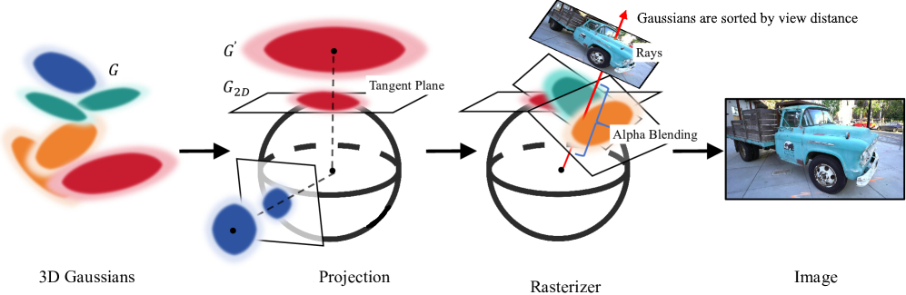
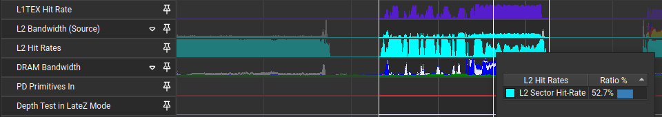
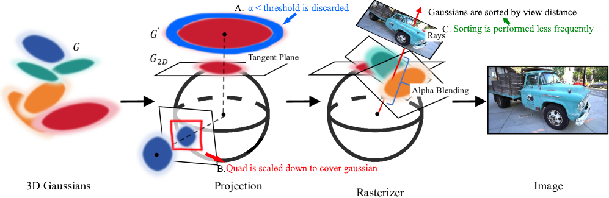
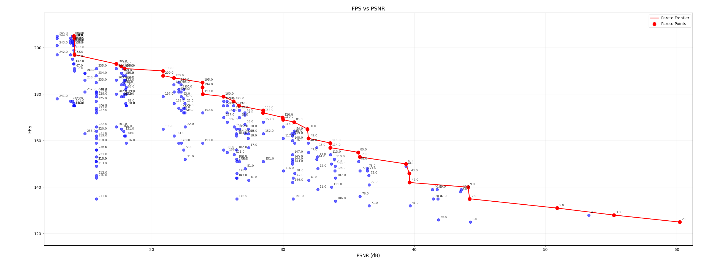
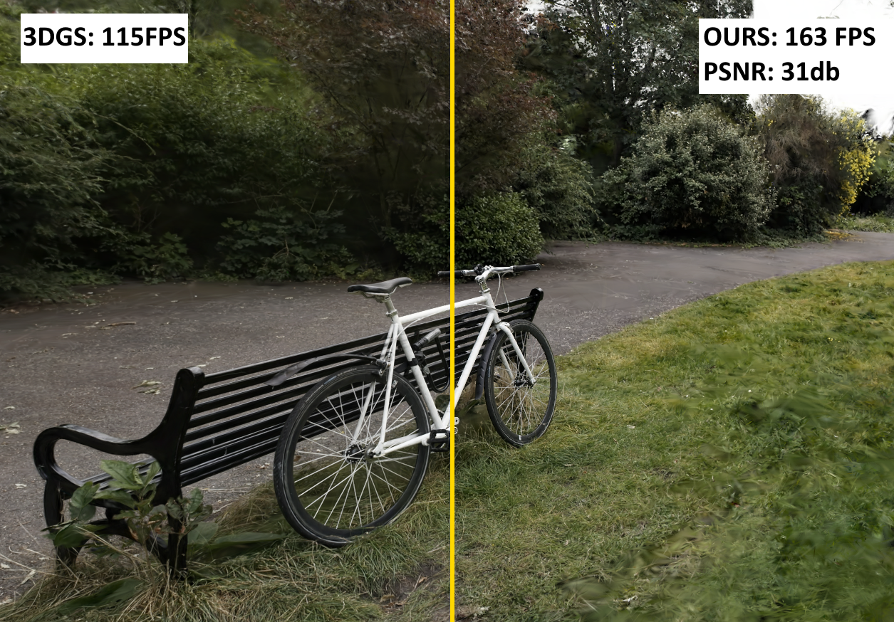
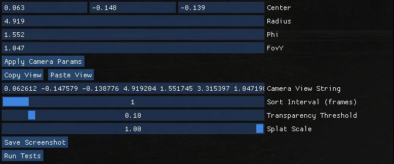

## Profiling and Optimizing 3D Gaussian Splatting on Low Powered Edge Devices
**Author:** Ahmed Nassar  


#Notes:

This project is based on the great vulkan implementation by @jaesung-cs. Here, I have only tried to optimize it further. please refer to their original repo for build instructions, dependencies, and requirements at https://github.com/jaesung-cs/vkgs
My goal was to maximize rendering speed without affecting visual quality considerably.


---

## 1. Problem
3D Gaussian splatting is a new novel view synthesis technique that has become increasingly popular due to its comparatively better performance than its counterparts such as radiance fields. However, its performance remains suboptimal for resource-limited devices such as VR headsets. These devices offer limited resources and require a high framerate to deliver an acceptable user experience.

---

## 2. Bottlenecks
1. Many fragments are unnecessarily being rendered. Either because the quad on which the gaussian is being projected is too large or because it has a very low alpha value at its edges that is barely visible yet is costly to render.
  
3. The sorting step (necessary for correct alpha blending) is very costly. Sorting every frame seems unnecessary as in many cases the changes between each frame are negligible (for a static scene).

  - Sort step has a low L1/L2 hit rate (< 60%). This makes sense as the sorting step is non-cache friendly and the Jetson’s Ampere GPU has limited memory (128KB L1, 512KB L2).   

---

## 3. Solution
We perform three different optimizations:
- **A.** Discard fragments below a fixed threshold in the fragment shader.  
- **B.** Scale down the quad until it closely borders the splat.  
- **C.** Sort every *n-th* frame instead of each frame.
    

---

## 4. Method & Results
We captured 245 different frames. For each frame we varied three parameters (splat scale, alpha threshold, sorting interval). We then measured their PSNR against the base frame (when none of the parameters are changed). Note that the base frame is not actually ground truth.


 The image below is the frame at the center of the red line with settings:
- `alpha_thres = 0.02`  
- `splat_scale = 0.6`  
- `sort_interval = 5`  



*Note: These tests were conducted on PC for speed. Results will be reproduced on Jetson Orin.*

---

## 5. Future Work
- **Dynamic Sorting Scheduler:** Sort more frequently when there is quicker change in scenery. For example, calculate a motion vector for the camera and sort more aggressively when velocity is high, and less when motion is small.  
- **Cache Friendly Radix Sort:** Instead of sorting each frame from scratch, cache partial steps of GPU radix sort across consecutive frames to improve cache hit rate.  
- **DLSS Frame Generation:** Explore integrating NVIDIA DLSS for frame generation.  

---

## 6. References
Kerbl, B., Kopanas, G., Leimkühler, T., & Drettakis, G. (2023). *3D Gaussian Splatting for Real-Time Radiance Field Rendering*. ACM Transactions on Graphics, **42**(4).  
[Project Page](https://repo-sam.inria.fr/fungraph/3d-gaussian-splatting/)


## the following is copied from the original repositoy by cs-jaesung

### Requirements
- `VulkanSDK>=1.3.296.0`
  - `slangc` (or `slangc.exe` for Windows) is included in or above `1.3.296.0`.
  - Required by `vulkan_radix_sort` submodule to compile `slang` shader files.
  - Download the latest version from https://vulkan.lunarg.com/ and follow install instruction.
- `cmake>=3.15`


### Dependencies
- submodules
  ```bash
  $ git submodule update --init --recursive
  ```
  - VulkanMemoryAllocator
  - glm
  - glfw
  - imgui
  - argparse
  - [vulkan_radix_sort](https://github.com/jaesung-cs/vulkan_radix_sort): my Vulkan/GLSL implementation of reduce-then-scan radix sort.


### Build
```bash
$ cmake . -B build
$ cmake --build build --config Release -j
```


### Run
```bash
$ ./build/vkgs_viewer  # or ./build/Release/vkgs_viewer
$ ./build/vkgs_viewer -i <ply_filepath>
```
Drag and drop pretrained .ply file from [official gaussian splatting](https://github.com/graphdeco-inria/gaussian-splatting), Pre-trained Models (14 GB).

- Left drag to rotate.

- Right drag, or Ctrl + left drag to translate.

- Left+Right drag to zoom in/out.

- WASD, Space to move.

- Wheel to zoom in/out.

- Ctrl+wheel to change FOV.


### Test


You can either test manually through the parameters in the UI which allows you to play with the settings in real time. Or you could perform the automated testings to find the best parameter settings.
Note that since the testing is purely testing fps/psnr of each frame, we preform the comparisons from a fixed point of view. you can set the camera at whatever pose you like then hit F12 to begin automated testing or press the UI button.
I have also added buttons in the interface to copy and paste a camera's viewpoint (location and rotation). So you can save the viewport across different runs.

To perform automated tests. first, run your scene. fix the camera somewhere, then hit F12. this will save multiple frames into the runs folder. ones the frames are saved. you can run the psnr_calculator script to perform the tests and generate a CSV file containing different parameter values and their respective FPS/PSNR's. 

```bash
$ python
>>> import pygs
>>> pygs.show()
>>> pygs.load("./models/bicycle_30000.ply")  # asynchronously load model to viewer
>>> pygs.load("./models/garden_30000.ply")
>>> pygs.close()
```

Note** the testing code is at Engine.cc. under the preprocessor definition ENABLE_TESTING. So you can enable and disable it as you see fit.
